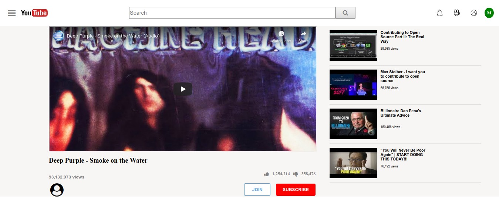

# youtube-html-clone

## Table of Contents

* [About the Project](#about-the-project)
  * [Built With](#built-with)
* [Contact](#contact)
* [Acknowledgements](#acknowledgements)

<!-- ABOUT THE PROJECT -->
## About The Project

The goal of this project is to build a Youtube video player page focusing on making the media elements to show up.

URL to the live version of our project:
[Simple Youtube Clone](https://raw.githack.com/ermin-cahtarevic/youtube-html-clone/feature-branch/index.html)

### Built With

*   HTML
*   CSS

<!-- CONTACT -->
## Contact

Melissa Castorena - mcastorena0316@gmail.com

Ermin Cahtarevic- erminc@windowslive.com

<!-- ACKNOWLEDGEMENTS -->
## Acknowledgements

* [Microverse](https://www.microverse.org/)
